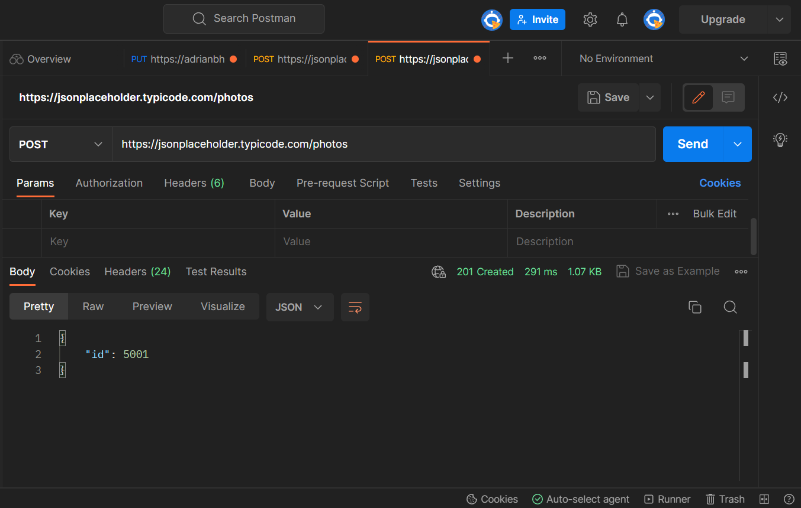
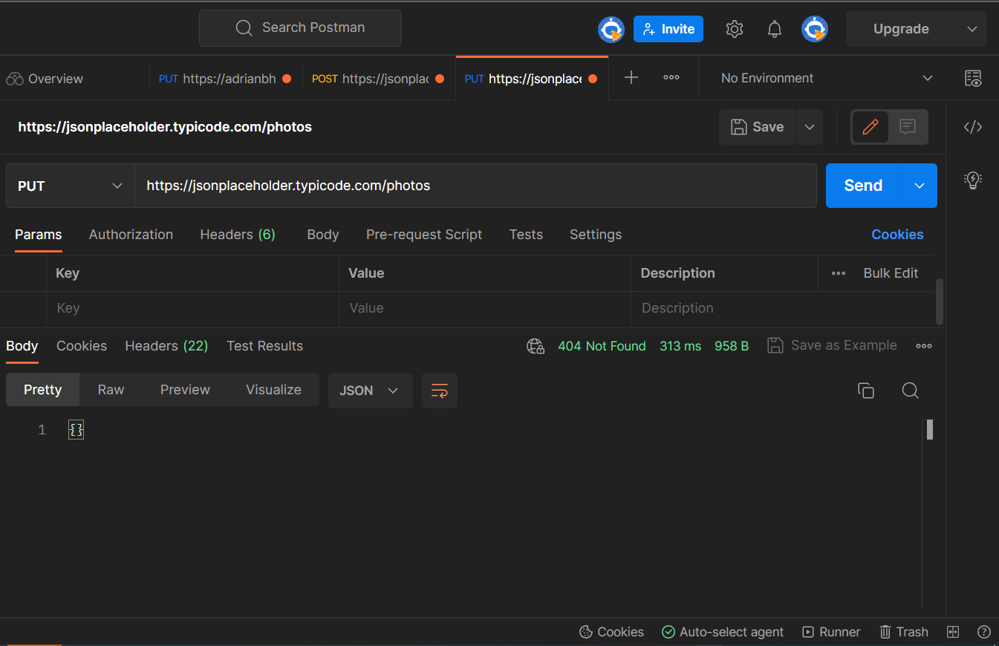
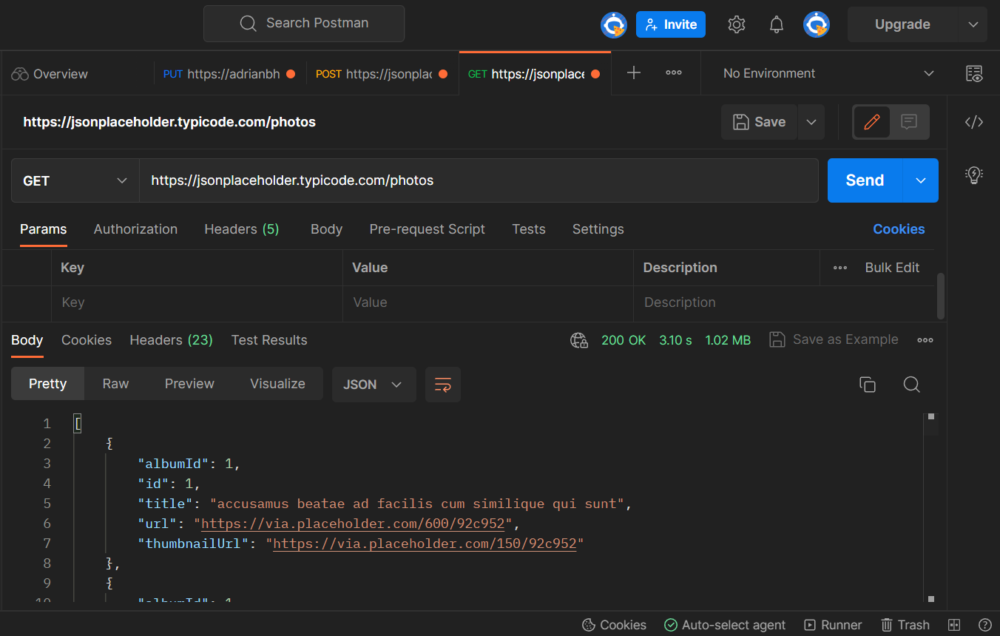
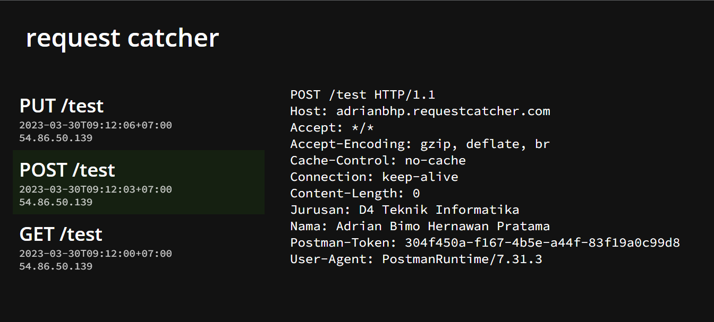
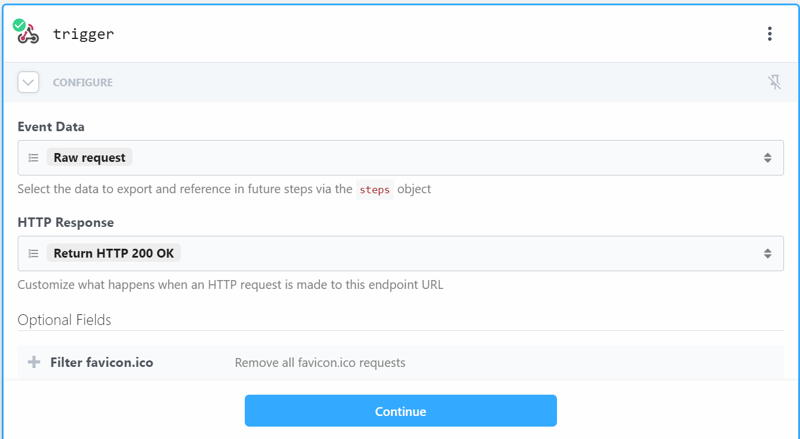
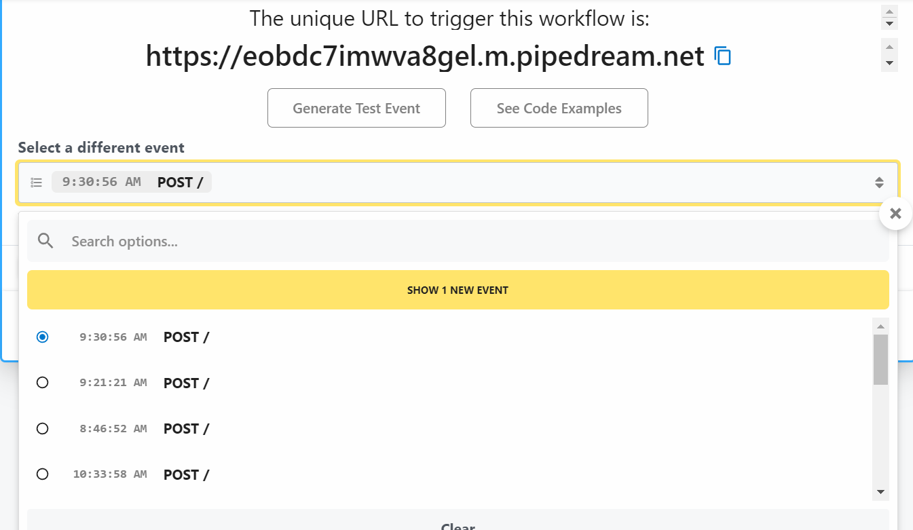
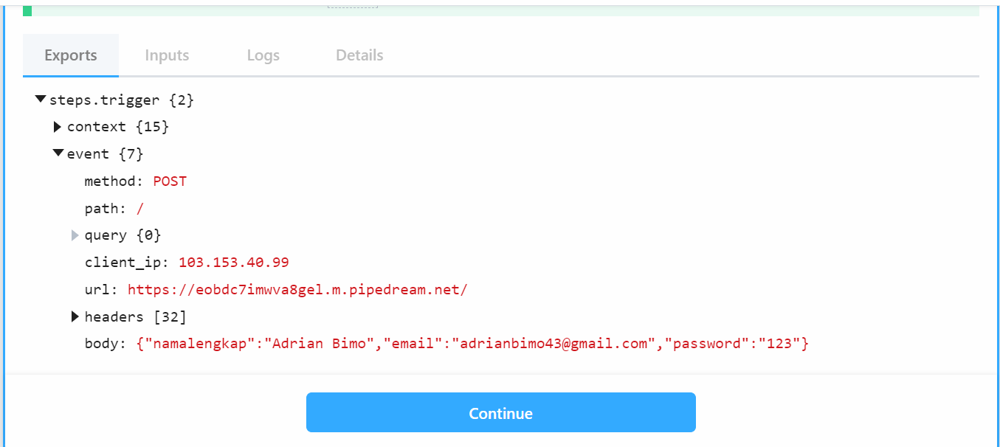

# SOAL UTS

# 1. Buat Tampilan Front End menggunakan component pada tailwinds (index)


Berikut ini merupakan Source Code dari Tailwind :

```
<!DOCTYPE html>
<html lang="en">
<head>
    <title>Page title</title>
    <meta charset="utf-8">
    <meta name="viewport" content="width=device-width, initial-scale=1, shrink-to-fit=no">
    <link rel="preconnect" href="https://fonts.gstatic.com">
    <link rel="stylesheet" href="https://fonts.googleapis.com/css2?family=Outfit:wght@500;600;700&display=swap">
    <link rel="stylesheet" href="https://fonts.googleapis.com/css2?family=Inter:wght@400;500;700&display=swap">
    <link rel="stylesheet" href="css/tailwind/tailwind.min.css">
    <link rel="icon" type="image/png" sizes="32x32" href="shuffle-for-tailwind.png">
    <script src="js/main.js"></script>
</head>
<body class="antialiased bg-body text-body font-body">
    <div class="">
    </div>
</body>
</html>
```

Berikut ini merupakan Source code dari HTML :

```
<!DOCTYPE html>
<html lang="en">
<head>
    <title>Page title</title>
    <meta charset="utf-8">
    <meta name="viewport" content="width=device-width, initial-scale=1, shrink-to-fit=no">
    <link rel="preconnect" href="https://fonts.gstatic.com">
    <link rel="stylesheet" href="https://fonts.googleapis.com/css2?family=Outfit:wght@500;600;700&display=swap">
    <link rel="stylesheet" href="https://fonts.googleapis.com/css2?family=Inter:wght@400;500;700&display=swap">
    <link rel="stylesheet" href="css/tailwind/tailwind.min.css">
    <link rel="icon" type="image/png" sizes="32x32" href="shuffle-for-tailwind.png">
    <script src="js/main.js"></script>
</head>
<body class="antialiased bg-body text-body font-body">
    <div class=""
      <section class="relative pt-16 pb-36 bg-gradient-gray2 overflow-hidden">
        
        <div class="relative z-10 container mx-auto px-4">
          
          <div class="flex flex-wrap -m-6">
            <div class="w-full p-6">
              <div class="md:max-w-xl text-center mx-auto">
                <h2 class="mb-4 font-heading font-bold text-gray-900 text-6xl sm:text-7xl">Ready to get started?</h2>
                <p class="mb-11 text-lg text-gray-500">Lorem ipsum dolor sit amet, consectetur adipis.</p>
                <div class="flex flex-wrap max-w-md mx-auto -m-2 mb-5">
                  <div class="w-full p-2">
                    <input id = "namalengkap" class="w-full px-5 py-3.5 text-gray-500 placeholder-gray-500 bg-white outline-none focus:ring-4 focus:ring-indigo-500 border border-gray-200 rounded-lg" type="text" placeholder="Full name" name="full-name">
                  </div>
                  <div class="w-full p-2">
                    <input id = "email" class="w-full px-5 py-3.5 text-gray-500 placeholder-gray-500 bg-white outline-none focus:ring-4 focus:ring-indigo-500 border border-gray-200 rounded-lg" type="text" placeholder="Email address" name="email">
                  </div>
                  <div class="w-full p-2">
                    <input id = "password" class="w-full px-5 py-3.5 text-gray-500 placeholder-gray-500 bg-white outline-none focus:ring-4 focus:ring-indigo-500 border border-gray-200 rounded-lg" type="password" placeholder="Password" name="password">
                  </div>
                  <div class="w-full p-2">
                    <div class="group relative">
                      <div class="absolute top-0 left-0 w-full h-full bg-gradient-blue opacity-0 group-hover:opacity-50 rounded-lg transition ease-out duration-300"></div>
                      <button class="p-1 w-full font-heading font-medium text-base text-white overflow-hidden rounded-md">
                        <div class="relative py-4 px-9 bg-gradient-blue overflow-hidden rounded-md">
                          <div class="absolute top-0 left-0 transform -translate-y-full group-hover:-translate-y-0 h-full w-full bg-gray-900 transition ease-in-out duration-500"></div>
                          <p  onclick="PushButton()" id="tombol" class="relative z-10">Sign Up</p>
                        </div>
                      </button>
                    </div>
                  </div>
                </div>
                <p class="text-base text-gray-600">
                  <span>Already have an account?</span>
                  <a class="text-gray-900 hover:text-gray-700" href="#">Login now</a>
                </p>
              </div>
            </div>
          </div>
        </div>
      </section>
    </div>
        <script src="./js/first.js"></script>
</body>
</html>
```

# 2. Buat file javascript untuk menghubungkan frontend dengan CSS pada componen tailwinds

Berikut ini merupakan source code pada file First.js

```
function PostSignUp(namalengkap,email,password){
var myHeaders = new Headers();
myHeaders.append("Login", "rollygantengsekali");
myHeaders.append("Content-Type", "application/json");

       var raw = JSON.stringify({
           "namalengkap": namalengkap,
           "email": email,
           "password": password
       });

       var requestOptions = {
           method: 'POST',
           headers: myHeaders,
           body: raw,
           redirect: 'follow'
       };

       fetch("https://eobdc7imwva8gel.m.pipedream.net", requestOptions)
           .then(response => response.text())
           .then(result => console.log(result))
        .catch(error => console.log('error', error));

    function GetResponse(result){
        document.getElementById("formsignup").innerHTML = result;

}
}
function PushButton(){
namalengkap = document.getElementById("namalengkap").value;
email=document.getElementById("email").value;
password=document.getElementById("password").value;
PostSignUp(namalengkap,email,password);
}
```

Berikut ini merupakan source code pada file main.js

```
// Burger menus
document.addEventListener('DOMContentLoaded', function() {
    // open
    const burger = document.querySelectorAll('.navbar-burger');
    const menu = document.querySelectorAll('.navbar-menu');

    if (burger.length && menu.length) {
        for (var i = 0; i < burger.length; i++) {
            burger[i].addEventListener('click', function() {
                for (var j = 0; j < menu.length; j++) {
                    menu[j].classList.toggle('hidden');
                }
            });
        }
    }

    // close
    const close = document.querySelectorAll('.navbar-close');
    const backdrop = document.querySelectorAll('.navbar-backdrop');

    if (close.length) {
        for (var i = 0; i < close.length; i++) {
            close[i].addEventListener('click', function() {
                for (var j = 0; j < menu.length; j++) {
                    menu[j].classList.toggle('hidden');
                }
            });
        }
    }

    if (backdrop.length) {
        for (var i = 0; i < backdrop.length; i++) {
            backdrop[i].addEventListener('click', function() {
                for (var j = 0; j < menu.length; j++) {
                    menu[j].classList.toggle('hidden');
                }
            });
        }
    }
});
```

# 3. Gunakan API Public yang dapat diakses dan lakukan pengujian postman pastikan data variable tampil pada console (screenshoot)







# 4. Lakukan pengujian pada https://requestcatcher.com/





# 5. Membuat Endpoint menggunakan postman dari Pipedream








Endpoint Postman


# 6. Tambahkan fungsi PostSignUp() yang berfungsi untuk melakukan Post Form Data Sign Up. FUngsi ini diambil dari postman

Dibawah ini merupakan source code dari fungsi PostSIgnUp()

```
function PostSignUp(namalengkap,email,password){
       var myHeaders = new Headers();
       myHeaders.append("Login", "rollygantengsekali");
       myHeaders.append("Content-Type", "application/json");

       var raw = JSON.stringify({
           "namalengkap": namalengkap,
           "email": email,
           "password": password
       });

       var requestOptions = {
           method: 'POST',
           headers: myHeaders,
           body: raw,
           redirect: 'follow'
       };

       fetch("https://eobdc7imwva8gel.m.pipedream.net", requestOptions)
           .then(response => response.text())
           .then(result => console.log(result))
           .catch(error => console.log('error', error));
}
```

# 7. Membuat fungsi PushButton() untuk melakukan aksi tombol pada bagian html button tambahkan atribut onclick

Dibawah ini merupakan source code PushButton()

```
 function PushButton(){
       namalengkap = document.getElementById("namalengkap").value;
       email=document.getElementById("email").value;
       password=document.getElementById("password").value;
       PostSignUp(namalengkap,email,password);
 }
```

Dibawah ini merupakan source code onclick

```
 <p  onclick="PushButton()" id="tombol" class="relative z-10">Sign Up</p>
```

# 8. Kita test dengan klik kanan Open with live server, kita isi form nya sambil inspect console console data success dikirim, kemudian kita lihat pada dashboard pipedream data sudah diterima dengan baik oleh endpoint baik itu header maupun body


# 9. Sertakan skrinsutan dari live server aplikasi dan pipedream.com


# 10. Sertakan link Github Pages Sudah jalan di repo masing-masing

# 11. Semua proses di screenshoot dan dijalankan pada README.md

```

```
